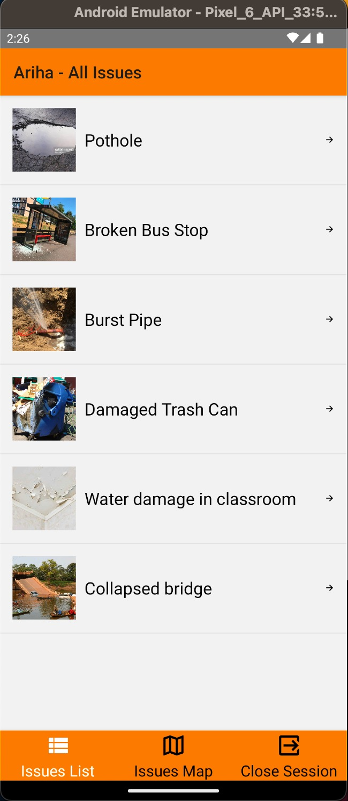
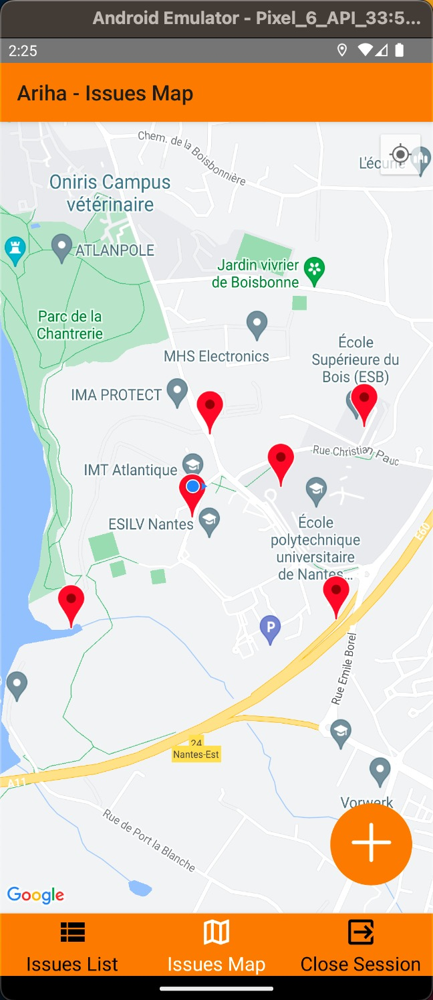

# Suivi de la Communauté des Questions Urbaines

IMT Atlantique - TAF LOGIN* - UE E Hackathon

### Équipe:

* [Gustavo NASCIMENTO SOARES](https://github.com/orgs/Hackathon-LOGIN-2023/people/gnsoares)
* [Jhon MUÑOZ](https://github.com/orgs/Hackathon-LOGIN-2023/people/jhon-munoz)
* [Jhonathan Mcniven CAGUA HERRERA](https://github.com/orgs/Hackathon-LOGIN-2023/people/mcniven3842)
* [Mohammed-Aymane OUGGADI](https://github.com/orgs/Hackathon-LOGIN-2023/people/MohammedAymane)
* [Sonda MAKNI](https://github.com/orgs/Hackathon-LOGIN-2023/people/Sondama)

## Application Mobile




Basé sur le framework React Native, ce projet est configuré pour fonctionner uniquement comme une **application Android**.

### Prérequis

* [`npm`](https://docs.npmjs.com/downloading-and-installing-node-js-and-npm)
* [`npx`](https://www.npmjs.com/package/npx)

### Exécution

1. Follow [React Native tutorial](https://reactnative.dev/docs/environment-setup) to setup Android Emulator

2. Installation des paquets
```bash
npm install
```
3. Initier le serveur Metro
```bash
npx react-native start
```
4. Installer et exécuter l'application Android
```bash
npx react-native run-android
```

### Pour obtenir un fichier apk

React Native génère un apk dans `android/app/build/outputs/apk` à chaque fois que `npx react-native run-android` est exécuté.
